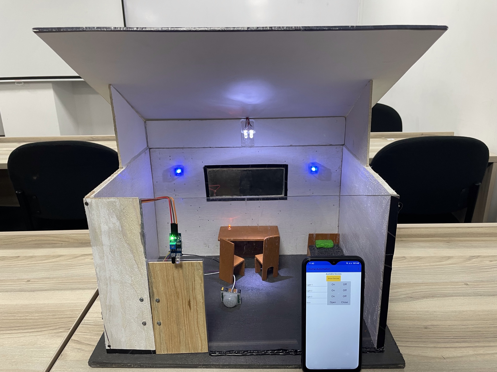

<div align="center">

# 🏠 Home Automation System

**A smart IoT solution combining Arduino hardware and a Flutter mobile app to bring intelligent automation to your home.**

[](https://flutter.dev)
[](https://dart.dev)
[](https://arduino.cc)
[](https://flutter.dev)
[](LICENSE)

</div>

---

## 📸 Hardware Preview

<div align="center">
  
</div>

---

## 🌟 Overview

The **Home Automation System** is a full-stack IoT project that bridges physical hardware with a beautifully crafted Flutter mobile application. An **ESP8266 Wi-Fi module** hosts a lightweight HTTP web server on your local network, giving the Flutter app direct control over LEDs and a servo motor-driven door.

Designed with accessibility in mind — particularly for the **elderly and disabled** — the system offers a clean, intuitive mobile interface to manage lights and door locks without any physical effort.

---

## ✨ Features

| Feature | Description |
|---|---|
| 💡 **Smart Lighting (White)** | Main bedroom lights controlled via app or PIR motion sensor |
| 🕯️ **Study / Table Lamp** | Warm orange lighting for focused study or work sessions |
| 🌙 **Sleep Mode** | Soft blue lighting for a relaxing, sleep-friendly ambiance |
| 🚪 **Smart Door Control** | Servo motor-powered door that opens/closes from the app |
| 🤖 **PIR Auto-Lights** | Motion-based automatic lighting — on when you enter, off after 5 s of no motion |
| 📡 **IR Sensor Auto-Door** | Proximity-triggered door that opens when someone approaches |
| 🌡️ **Environment Dashboard** | Real-time display of Humidity, Temperature, and Energy usage |
| 🌗 **Dark / Light Theme** | Toggleable dark and light modes in the app |
| 🔔 **Toast Notifications** | Animated in-app feedback for every control action |

---

## 🏗️ System Architecture

```
┌──────────────────────────────────┐      Wi-Fi (HTTP GET)     ┌───────────────────────┐
│      Flutter Mobile App          │ ◄───────────────────────► │  ESP8266 Web Server   │
│  ┌───────────┐  ┌─────────────┐  │                           │      (Port 80)        │
│  │  Control  │  │  About Us   │  │                           └───────────┬───────────┘
│  │   Page    │  │    Page     │  │                                       │
│  └───────────┘  └─────────────┘  │                           ┌───────────▼───────────┐
│      Provider (Theme/State)      │                           │  Arduino / ESP8266    │
└──────────────────────────────────┘                           │  ┌─────────────────┐  │
                                                               │  │ LED White  × 2  │  │
                                                               │  │ LED Blue   × 2  │  │
                                                               │  │ LED Orange × 1  │  │
                                                               │  │ Servo Motor     │  │
                                                               │  │ PIR Sensor      │  │
                                                               │  │ IR Sensor       │  │
                                                               │  └─────────────────┘  │
                                                               └───────────────────────┘
```

---

## 📱 Flutter App Structure

```
lib/
├── main.dart                    # Entry point — Provider setup & MaterialApp
├── Pages/
│   ├── main_page.dart           # Root scaffold with bottom navigation
│   ├── home_screen.dart         # Control dashboard (lights + door)
│   └── about_us.dart            # Project info, aims & methodology
├── Models/
│   ├── top_card.dart            # Environment status bar (Humidity, Energy, Temp)
│   ├── widget.dart              # Reusable control tile widget
│   └── bottom_nav_bar.dart      # Custom Google-style bottom nav bar
├── Providers/
│   └── theme_provider.dart      # Dark / Light theme state management
└── Theme/
    └── (theme definitions)
```

---

## 🔌 Hardware & Wiring

### Components Required

| Component | Qty | Purpose |
|---|---|---|
| ESP8266 NodeMCU | 1 | Wi-Fi + HTTP Web Server (main controller) |
| White LEDs | 2 | Main bedroom lighting |
| Blue LEDs | 2 | Sleep / ambient mode lighting |
| Orange LED | 1 | Study / desk lamp |
| Servo Motor | 1 | Motorised door open/close mechanism |
| PIR Sensor | 1 | Motion detection for automatic lights |
| IR Sensor | 1 | Proximity detection for automatic door |

### ESP8266 Pin Configuration

| GPIO Pin | Component | Description |
|---|---|---|
| `D0` | Servo Motor | Door actuator |
| `D1` | IR Sensor | Proximity-triggered door |
| `D2` | PIR Sensor | Motion-triggered lights |
| `D4` | LED White 1 | Main light (primary) |
| `D5` | LED White 2 | Main light (paired) |
| `D6` | LED Blue 1 | Sleep light (primary) |
| `D7` | LED Blue 2 | Sleep light (paired) |
| `D8` | LED Orange | Study lamp |

---

## 🌐 HTTP API Reference

The ESP8266 exposes a simple REST-like interface over HTTP `GET` requests:

| Endpoint | Action |
|---|---|
| `GET /led_white/on` | ✅ Turn on main white lights & disable PIR auto-control |
| `GET /led_white/off` | ✅ Turn off main white lights & re-enable PIR auto-control |
| `GET /led_blue/on` | ✅ Turn on blue sleep lights |
| `GET /led_blue/off` | ✅ Turn off blue sleep lights |
| `GET /led_orange/on` | ✅ Turn on orange study lamp |
| `GET /led_orange/off` | ✅ Turn off orange study lamp |
| `GET /door/open` | ✅ Rotate servo to 160° (open door) |
| `GET /door/close` | ✅ Rotate servo to 0° (close door) |

> **Smart PIR Logic:** PIR auto-control is intelligently **suspended** when you manually turn on the white light from the app, and **resumed** when you turn it off — preventing conflicts between manual and automatic control.

---

## 🚀 Getting Started

### Prerequisites

- [Arduino IDE](https://www.arduino.cc/en/software) v2.x
- [Flutter SDK](https://flutter.dev/docs/get-started/install) `^3.5.4`
- **ESP8266 Board Package** installed in Arduino IDE (`Boards Manager → esp8266`)
- An Android or iOS device / emulator
- Both your phone and ESP8266 on the **same Wi-Fi network**

---

### Step 1 — Arduino Setup

1. Open `Arduino Code/Home_Automation/Home_Automation.ino` in Arduino IDE.

2. Install required libraries via **Library Manager**:
   - `ESP8266WiFi` (bundled with ESP8266 board package)
   - `ESP8266WebServer` (bundled)
   - `Servo`

3. Update your credentials in the sketch:
   ```cpp
   const char* ssid     = "YOUR_WIFI_SSID";
   const char* password = "YOUR_WIFI_PASSWORD";
   ```

4. Select your board: **Tools → Board → NodeMCU 1.0 (ESP-12E Module)**

5. Upload the sketch. Open **Serial Monitor** at `115200` baud and note the **IP address** printed on connection.

---

### Step 2 — Flutter App Setup

1. Clone the repository:
   ```bash
   git clone https://github.com/kavindualwis/Home-Automation-System-Using-Arduino-Flutter-Mobile-App.git
   cd Home-Automation-System-Using-Arduino-Flutter-Mobile-App
   ```

2. Update the ESP8266 IP address in [`lib/Pages/home_screen.dart`](lib/Pages/home_screen.dart):
   ```dart
   final String espIp = "192.168.x.x";  // ← Replace with your ESP8266 IP
   ```

3. Install dependencies:
   ```bash
   flutter pub get
   ```

4. Run on a connected device or emulator:
   ```bash
   flutter run
   ```

---

## 📦 Dependencies

```yaml
dependencies:
  http: ^1.2.2              # HTTP GET requests to the ESP8266
  provider: ^6.1.2          # State management (theme + device controls)
  google_fonts: ^6.2.1      # Poppins font for a clean UI
  google_nav_bar: ^5.0.7    # Stylish bottom navigation bar
  delightful_toast: ^1.1.0  # Animated toast notifications
  cupertino_icons: ^1.0.8   # iOS-style icon set
```

---

## 🤖 Automation Logic

### PIR Motion Sensor → Auto-Lights
1. **Motion detected** → White LEDs turn **ON** immediately.
2. **No motion for 5 seconds** → White LEDs turn **OFF** automatically.
3. If lights are **manually turned ON** via the app, PIR control is **disabled** to prevent conflicts.
4. When lights are **manually turned OFF**, PIR control is **re-enabled**.

### IR Proximity Sensor → Auto-Door
1. **Object detected** → Servo sweeps from 160° → 0° (door **opens**).
2. **Object removed** → After a **3-second** delay, servo sweeps from 0° → 160° (door **closes**).

---

## 🎯 Project Objectives

- ✅ **Automated Door Entry** — Hands-free operation via IR proximity sensor
- ✅ **Automated Entry/Exit Lighting** — PIR motion-based smart lighting
- ✅ **Mood-Based Lighting** — White (bright), Blue (sleep), Orange (study) modes
- ✅ **Eldercare Accessibility** — Simple one-tap interface for elderly and disabled users
- ✅ **Mobile Application Control** — Full control of the home from your smartphone

---

## 🔭 Future Enhancements

- [ ] 🎙️ Voice control (Google Assistant / Siri Shortcuts)
- [ ] 📊 Real-time DHT11 sensor data for actual temperature & humidity
- [ ] 🤖 ML-based predictive lighting from learned user behaviour
- [ ] 💨 Fan / AC speed control integration
- [ ] 🔐 User authentication & multiple user profiles
- [ ] 🌍 Remote access via MQTT / Firebase Cloud
- [ ] 📱 Home screen widget for one-tap quick controls

---

## 📄 License

This project is licensed under the **MIT License** — see the [LICENSE](LICENSE) file for details.

---

## 🙌 Acknowledgments

- Inspired by modern **IoT smart home** ecosystems
- Built with ❤️ using **Flutter** and **Arduino / ESP8266**
- Thanks to the open-source Flutter and ESP8266 developer communities

---

<div align="center">
  <strong>Made with ❤️ by Kavindu Alwis</strong>
</div>
